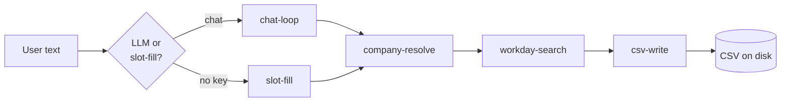

# Skills

`job-search-bot` ships with two interpretations of "skill":

1. **A Claude Code skill** — invokable from any Claude Code session.
2. **Internal skills** — the responsibilities of each module, framed
   as discrete capabilities the bot composes to do its job.

This page documents both.

---

## Part 1 — The Claude Code skill

**Location:** [`.claude/skills/job-search/SKILL.md`](../.claude/skills/job-search/SKILL.md)

A skill in Claude Code is a markdown file with YAML frontmatter that
tells Claude:

1. **When** to use it (the `description` field is the trigger).
2. **How** to do it (the body is instructions Claude follows).

Once present in `.claude/skills/`, Claude detects it automatically.
You don't import, register, or install anything.

### Trigger description

> Search a company's Workday careers site for job postings matching
> keywords and write the results to a CSV. Trigger when the user asks
> to find, list, or fetch jobs at a known company.

### What the skill does

Given a request like *"find me PwC AI jobs in Bangalore"*, the skill:

1. Pulls `company=pwc`, `keywords=AI`, `location=Bangalore` from the
   user's natural-language sentence.
2. Shells out to the bot:
   ```bash
   printf 'pwc\nAI\nBangalore\nquit\n' | uv run job-search-bot
   ```
3. Surfaces the saved CSV path back to the user.

### Why this matters

You don't have to `cd` to the project folder or remember the exact
prompts. Claude does it for you. The skill is a thin facade over the
existing CLI — no LLM API key needed (the bot's slot-fill mode runs
purely on local code).

---

## Part 2 — Internal skills (module responsibilities)

The bot's modules are best thought of as composable skills, each with
one job. The CLI orchestrates them in sequence.

### Skill: company-resolve

| Property | Value |
|---|---|
| **Module** | `companies.py` |
| **Input** | A free-text company name or alias, e.g. `"pwc"`, `"JP Morgan"` |
| **Output** | A `Company(canonical_name, base_url, tenant, site)` or `None` |
| **Side effects** | None |
| **Owner** | Hardcoded registry of 8 companies + 8 aliases |
| **Failure mode** | Returns `None` — caller decides whether to ask user or give up |

**Why it's a skill, not a function:** in the multi-agent framing,
"figure out which company the user means" is a distinct piece of
reasoning. If we later add fuzzy matching or a web-search fallback,
the surface area stays the same.

---

### Skill: workday-search

| Property | Value |
|---|---|
| **Module** | `workday.py` |
| **Input** | `Company`, `keywords`, optional `location`, `limit` |
| **Output** | `list[JobPosting]` — already deduplicated, location-filtered |
| **Side effects** | HTTP POST to Workday tenant (no auth) |
| **Owner** | Pure function with `httpx.Client` |
| **Failure mode** | Raises `httpx.HTTPStatusError` on 5xx; returns `[]` on no matches |

**Pagination:** loops `limit=20` per page until empty page, `offset >=
total`, or caller's `limit` reached.

**Job-ID extraction:** regex `_([A-Z0-9-]+WD)(?:-\d+)?$` against the
externalPath. Suffix-stripping deduplicates the same role posted to
multiple careers sites.

---

### Skill: csv-write

| Property | Value |
|---|---|
| **Module** | `csv_writer.py` |
| **Input** | `list[JobPosting]`, company slug, keyword slug, output dir |
| **Output** | Path to the written CSV |
| **Side effects** | Creates `output/` if missing; writes UTF-8 file |
| **Owner** | Pure function with `csv.DictWriter` |
| **Failure mode** | Raises `OSError` on disk problems |

**Filename pattern:** `{company_slug}_{keyword_slug}_{YYYY-MM-DD}.csv`.
Same-day re-runs overwrite — intentional.

---

### Skill: chat-loop (optional)

| Property | Value |
|---|---|
| **Module** | `bot.py` (`_chat_loop`) |
| **Input** | User's free-text query |
| **Output** | Calls the other three skills based on LLM parse |
| **Side effects** | Anthropic API calls |
| **Owner** | Single-tool tool-use loop |
| **Failure mode** | Falls back to slot-fill if `anthropic` package missing |

**Tool spec:** one tool — `search_workday_jobs(company, keywords,
location?, limit?)`. The chat loop is intentionally minimal: parse →
call → respond.

---

### Skill: slot-fill (fallback)

| Property | Value |
|---|---|
| **Module** | `bot.py` (`_slot_fill_loop`) |
| **Input** | Three terminal prompts |
| **Output** | Same as chat-loop, but without an LLM |
| **Side effects** | Terminal I/O |
| **Owner** | Pure REPL |
| **Failure mode** | Re-prompts on unknown company |

---

## How the skills compose



Each box is independently testable. Each arrow carries a typed value
(`Company`, `list[JobPosting]`, `Path`). No skill knows about the
other skills' internals — only their input/output contracts.

This is why adding a new ATS (Greenhouse, Lever) is small: replace
`workday-search` with a new module behind the same shape. The rest of
the chain doesn't change.

---

## Adding a new skill

To add a new capability (e.g., résumé scoring, job notifications,
deduplication across sessions), follow this pattern:

1. **Define the contract.** What's the input? What's the output?
   Both should be dataclasses from `models.py` (or new ones added
   there).
2. **Implement as a module with one public function.** No global
   state, no LLM client at module level.
3. **Wire it into `bot.py`.** Either as a new step in the existing
   chain, or as a new tool in `_chat_loop`'s tool spec.
4. **Document it here.** Add a table block matching the format above.
5. **Add a workflow recipe** in [`workflows.md`](workflows.md) showing
   the end-user how to use it.

---

## Related docs

- [`technical.md`](technical.md) — module-level reference docs.
- [`system-design.md`](system-design.md) — why the skill boundaries
  are drawn this way.
- [`workflows.md`](workflows.md) — recipes that compose these skills.
- [`user-manual.md`](user-manual.md) — running the composed system.
