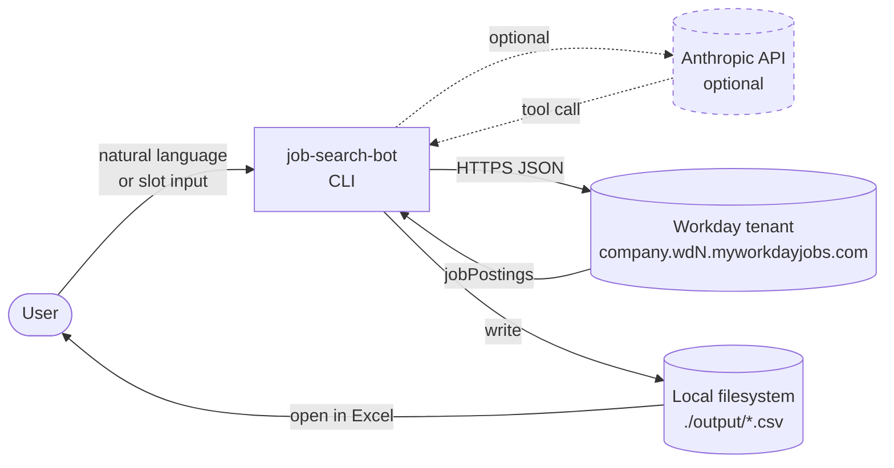
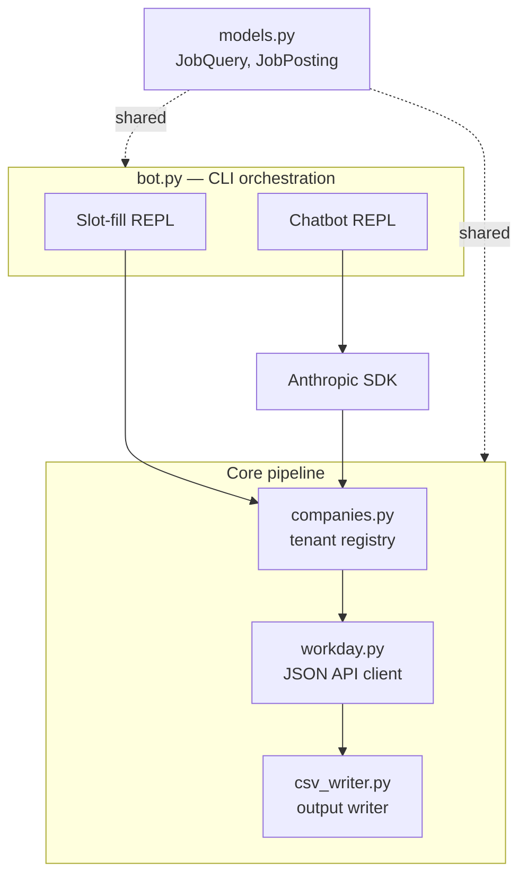
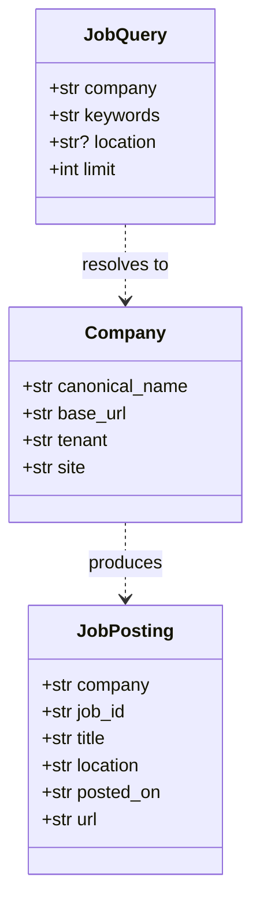
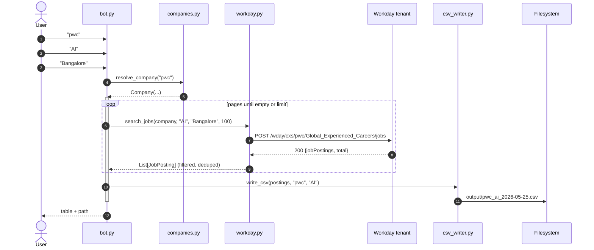
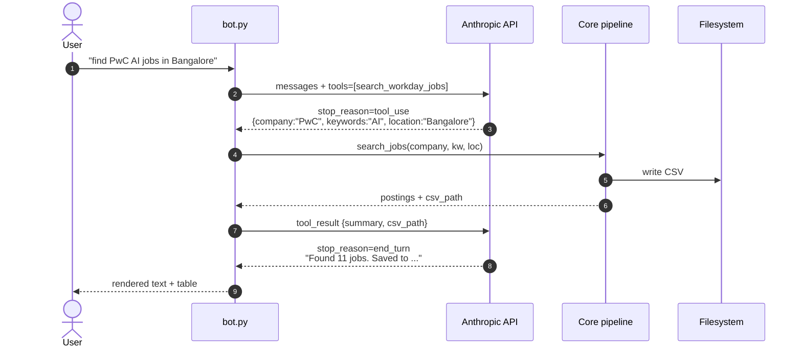

# System Design

> Architecture, data flow, and design rationale for `job-search-bot`.
> Pair this with [technical.md](technical.md) (implementation reference)
> and [user-manual.md](user-manual.md) (how to use it).

---

## 1. Overview

`job-search-bot` is a single-user command-line application that turns a
natural-language or slot-filled query into a CSV of matching job
postings from a target company's Workday careers site.

**Two execution modes**, picked at startup based on whether
`ANTHROPIC_API_KEY` is present:

| Mode | Trigger | Input | LLM cost |
|---|---|---|---|
| Slot-fill | no API key | three prompts (company, keyword, location) | $0 |
| Chatbot | API key set | free-text natural language | ~$0.001 per turn |

Both modes call the **same** downstream pipeline. The LLM is only a
front door for query parsing; it never touches the data path.

---

## 2. Goals and non-goals

### Goals

- **Zero-friction first run.** Works without any API key, no scraping,
  no browser, no signup. `git clone && uv sync && uv run`.
- **Honest results.** No HTML scraping, so we don't break when a careers
  site redesigns. Uses the same JSON API that the careers site itself
  uses.
- **Extensible.** Adding a new company is one dataclass entry. Adding a
  new ATS (Greenhouse, Lever, iCIMS) is one new module behind a stable
  `search_jobs()` interface.
- **Transparent.** Every search produces a timestamped, plain-text CSV
  the user can open in Excel, grep, diff, or commit.

### Non-goals

- Multi-user service. No auth, no persistence beyond CSVs on disk.
- Real-time. Each search is on-demand; no background polling.
- Job ranking or résumé matching. Could be a layer on top, but isn't this.
- Full coverage of every ATS. Workday-first by design; others are
  pluggable.
- Mobile / web UI. CLI only.

---

## 3. Context



The bot is a **terminal-only client** that sits between the user and
two upstream services. Anthropic is optional and dotted; Workday is the
only hard external dependency.

---

## 4. High-level architecture



**Three layers, each with a single responsibility:**

1. **CLI orchestration** — reads input, dispatches to the right REPL
   mode, renders output. Stateless except for chat-history buffer.
2. **Core pipeline** — pure functions that take a `Company` + query and
   return `list[JobPosting]`. No I/O concerns leak between modules.
3. **Models** — frozen dataclasses shared across both layers. The only
   coupling allowed in either direction.

---

## 5. Component breakdown

| Component | Type | Responsibility | Failure mode |
|---|---|---|---|
| `bot.main()` | Entry point | Choose REPL based on env, render rule, exit cleanly | Returns non-zero on uncaught exception |
| `bot._slot_fill_loop()` | REPL | Prompt user, run search, print table | Re-prompts on bad company; ignores empty input |
| `bot._chat_loop()` | REPL | Anthropic conversation + tool-use loop | Falls back to slot-fill if SDK missing |
| `companies.resolve_company()` | Pure | Map alias/name → `Company`; case+space insensitive | Returns `None` on miss |
| `workday.search_jobs()` | I/O | POST to Workday endpoint, paginate, filter, dedup | Raises `httpx.HTTPStatusError` on 5xx |
| `workday._extract_job_id()` | Pure | Regex out canonical job ID from `externalPath` | Falls back to last URL segment |
| `csv_writer.write_csv()` | I/O | Create `output/` if needed, write UTF-8 CSV | Raises `OSError` if disk full |
| `models.{JobQuery, JobPosting}` | Data | Typed records | n/a |

Each component is **independently testable** with stdlib only (no
network needed for `companies`, `csv_writer`, `models`, or
`_extract_job_id`).

---

## 6. Data model



`Company` is configuration data — eight rows in
[`companies.py`](../src/job_search_bot/companies.py) today.
`JobQuery` is the parsed user intent. `JobPosting` is the output unit;
exactly one row per CSV line.

---

## 7. External interfaces

### 7.1 Workday careers JSON API

| Property | Value |
|---|---|
| Auth | None (public API) |
| Method | `POST` |
| URL | `{base_url}/wday/cxs/{tenant}/{site}/jobs` |
| Body | `{"appliedFacets": {}, "limit": N, "offset": M, "searchText": "..."}` |
| Rate limit | Not documented; observed >100 req/min/IP without issue |
| Stability | Stable; Workday is a public-facing product API used by their own careers sites |

Server-side `searchText` matches fuzzy across title and description.
Location is **not** applied as a facet because facet IDs are opaque,
per-tenant UUIDs; we filter client-side instead.

### 7.2 Anthropic Messages API (optional)

| Property | Value |
|---|---|
| Auth | `ANTHROPIC_API_KEY` env var |
| Model | `claude-haiku-4-5-20251001` (overridable via `ANTHROPIC_MODEL`) |
| Tools | Single tool: `search_workday_jobs(company, keywords, location?, limit?)` |
| Max tokens | 1024 per turn |
| History | In-memory list of messages; lost on `quit` |

The bot acts as a tool-use harness, not an agent framework — there's
one tool and one loop. Anthropic returns either a `text` block (final
answer) or a `tool_use` block (instructs us to call the tool). We
respond with a `tool_result` and loop until we get plain text back.

---

## 8. Sequence diagrams

### 8.1 Slot-fill mode — no LLM



### 8.2 Chatbot mode — Anthropic tool-use loop



If `stop_reason` were `tool_use` again, the loop continues — but in
practice one search-per-turn is the steady state.

---

## 9. Failure modes

| Failure | Where it surfaces | Behavior | User experience |
|---|---|---|---|
| Unknown company | `resolve_company` returns `None` | `_run_search` returns error string | Bot shows known companies; user re-tries |
| No network | `httpx.post` raises `ConnectError` | Uncaught — falls to top of main | Stack trace; non-zero exit |
| Workday 5xx | `response.raise_for_status()` | Raises `HTTPStatusError` | Stack trace; recoverable on retry |
| Empty result page 1 | `jobPostings: []` | Returns `[]`, CSV **not** written | Bot prints "No matching jobs" |
| Missing `anthropic` package | `ImportError` inside `_chat_loop` | Logs and returns | Bot exits chat mode silently |
| Invalid API key | `anthropic.AuthenticationError` | Uncaught — bubble to user | Stack trace; user fixes key |
| Disk full | `csv_writer.open` raises `OSError` | Uncaught | Stack trace; recoverable |
| Ctrl-C / EOF | `_console.input` raises | Caught at REPL boundary | Clean exit |

**Design choice:** transient network failures are *not* retried inside
the bot. A retry layer would mask real outages and complicate the
mental model. Re-running the bot is one keystroke.

---

## 10. Security and privacy

- **No credentials stored anywhere.** The optional Anthropic key is
  read from `$ANTHROPIC_API_KEY` at runtime; never persisted.
- **No telemetry.** Network requests go to Workday and (optionally)
  Anthropic only. No analytics endpoint.
- **Output is plain text on local disk.** Treat the CSVs like any
  spreadsheet — they contain only data that's already public on the
  company's careers site.
- **No code execution.** The Anthropic tool spec exposes one function
  with strictly-typed string/integer parameters. The bot does not
  `eval`, `subprocess`, or `exec` LLM output.
- **User input is not echoed to upstreams unfiltered.** The
  `searchText` field is sent verbatim — this is safe because Workday
  treats it as an opaque search term, not a query language.

---

## 11. Performance

| Metric | Observed | Bottleneck |
|---|---|---|
| Cold start (slot-fill) | ~0.5 s | Python import |
| Cold start (chat) | ~1.0 s | `anthropic` SDK import |
| 100 jobs returned | ~2 s | Workday API latency (5×20 pages) |
| 1,000 jobs returned | ~15 s | Same; linear in pages |
| CSV write (100 rows) | < 10 ms | Disk |
| LLM round-trip per turn | ~1.5 s | Anthropic API |

The bot is **I/O-bound**, not CPU-bound. Pagination is sequential;
parallelizing it would help on huge result sets but isn't worth the
complexity at current usage.

---

## 12. Deployment

There is no deployment topology. The bot is a single Python package
installed locally:

```
~/Documents/job/job-search-bot/
  .venv/                 ← uv-managed virtual environment
  src/job_search_bot/    ← source code
  output/                ← CSVs, gitignored
```

No background process, no service, no port, no daemon. Each invocation
is a fresh process that exits when the user types `quit`.

For scheduled use, wrap in cron or a launchd plist — see
[user-manual.md §6](user-manual.md).

---

## 13. Design decisions

Lightweight ADR-style notes on the non-obvious choices.

### D-1. Why Workday-only first

Workday powers ~3,000 large employers (PwC, JPMorgan, Salesforce, etc.)
and exposes one consistent JSON API across all of them. Building for
Workday first means a single implementation covers a huge slice of
white-collar postings. Other ATSs (Greenhouse, Lever) come next as
drop-in modules.

### D-2. Why no scraping fallback in v1

Browser automation (Playwright) adds ~200 MB of binaries, a per-site
selector maintenance burden, and slow startup. The benefit only
materializes for the long tail of small-ATS companies. Defer until
real demand exists.

### D-3. Why a CLI, not a web UI

Single user, single machine, no auth needed. The output is a CSV — and
the best CSV viewer the user already has is Excel or Numbers. Wrapping
this in a web UI would just be reproducing those.

### D-4. Why optional LLM, not required

Three reasons:

1. **Cost.** $0 vs. cents-per-search matters at the experimentation
   stage.
2. **Reliability.** API outages happen; the slot-fill path keeps
   working.
3. **Honesty.** The LLM contributes parsing only, not data. Making it
   optional makes that boundary explicit.

### D-5. Why a single tool, not multiple

The whole bot has one job: turn (company, keywords) into a CSV. A
multi-tool agent would invite over-engineering — e.g., a separate
`resolve_company` tool would just be a wrapper around the registry the
LLM can already reason about from the prompt.

### D-6. Why client-side location filtering

Workday's `appliedFacets` location values are per-tenant UUIDs that
require a separate facet-discovery API call to look up. For a 100-row
result set, a `.lower() in .lower()` filter on `locationsText` is
faster and simpler than a two-step API dance. Trade-off: we might miss
postings whose location is encoded oddly.

### D-7. Why strip `-1`/`-2` suffixes from job IDs

The same role often appears across multiple careers sites (Global,
India, EU), each with a `-N` suffix. Stripping it gives a stable
canonical ID for dedup. Tested against PwC where ~15% of postings are
duplicates this way.

---

## 14. Extension points

Roadmap items, each well-bounded:

- **New ATS module.** Implement `search_jobs(company, ...)` in
  `lever.py` / `greenhouse.py`. Have `bot.py` dispatch on
  `Company.ats_vendor`. Estimated effort: 1 day per ATS.
- **Persistence layer.** Replace `csv_writer` with a `sqlite_writer`
  that maintains a `seen_jobs` table; surface only new postings on
  re-run. Estimated effort: half a day.
- **Scheduled diffs.** Cron the bot, diff today's CSV against
  yesterday's, email new rows. Estimated effort: half a day.
- **Local LLM.** Point the `anthropic` client at a LiteLLM proxy
  fronting Ollama. Tool-use semantics are preserved; cost drops to
  zero. Estimated effort: 2 hours.
- **Résumé fit scoring.** Add a second tool `score_jobs(csv_path,
  resume_path)` that batches postings to the LLM and returns a fit
  score column. Estimated effort: 1 day, only viable with API key.
- **Multi-company aggregation.** Accept a list of companies in one
  query, fan out concurrently with `asyncio`, concatenate CSVs.
  Estimated effort: half a day.

---

## 15. References

- [Workday careers API patterns](https://www.workday.com) — undocumented
  publicly; behavior reverse-engineered from real tenants.
- [Anthropic tool-use guide](https://docs.anthropic.com/en/docs/build-with-claude/tool-use)
- [`docs/technical.md`](technical.md) — implementation-level reference.
- [`docs/user-manual.md`](user-manual.md) — end-user guide.
- [`docs/non-technical.md`](non-technical.md) — plain-English overview.
