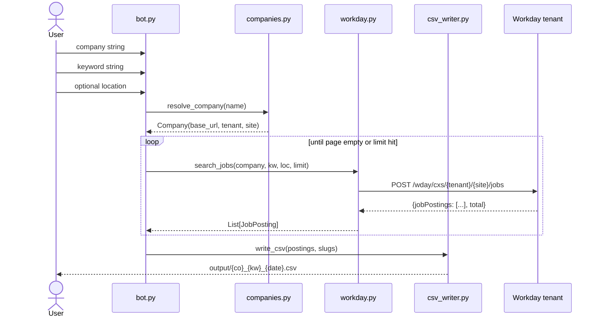
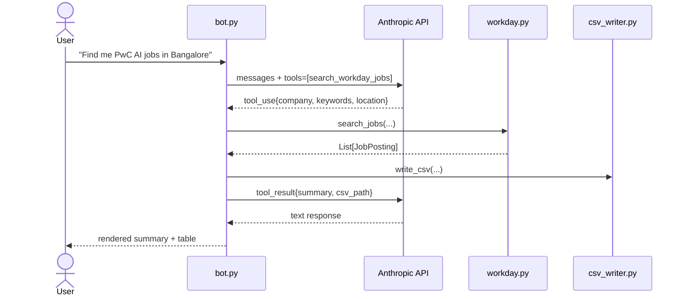

# Technical documentation

## Goal

Given a free-text query like "PwC AI jobs in Bangalore", produce a
deduplicated CSV of matching postings from the company's Workday tenant,
without any browser automation and without requiring an LLM API key for
the basic flow.

## System design

```
┌──────────────┐    ┌──────────────┐    ┌─────────────────┐    ┌──────────────┐
│   CLI (bot)  │───▶│  companies   │───▶│    workday      │───▶│  csv_writer  │
│ chat / slot  │    │   registry   │    │  JSON API call  │    │  ./output/   │
└──────┬───────┘    └──────────────┘    └─────────────────┘    └──────────────┘
       │                                                              ▲
       │ optional                                                     │
       ▼                                                              │
┌──────────────┐                                                      │
│ Anthropic    │ tool_use: search_workday_jobs(company, kw, loc, lim) │
│ Claude API   │──────────────────────────────────────────────────────┘
└──────────────┘
```

## Components

| Module | Responsibility | Public surface |
|---|---|---|
| `bot.py` | CLI entry, two REPL modes, Claude tool-use loop | `main()` |
| `companies.py` | Workday tenant registry + alias resolution | `resolve_company`, `known_companies` |
| `workday.py` | Authenticated-less JSON paginator | `search_jobs` |
| `csv_writer.py` | Slugged, dated CSV output | `write_csv` |
| `models.py` | `JobQuery`, `JobPosting` dataclasses | both classes |

## Request flow

### Slot-fill mode (no API key)



### Conversational mode (Anthropic SDK)



## Workday API contract

**Endpoint** (unauthenticated, JSON):
```
POST {base_url}/wday/cxs/{tenant}/{site}/jobs
Content-Type: application/json
```

**Request body:**
```json
{
  "appliedFacets": {},
  "limit": 20,
  "offset": 0,
  "searchText": "AI"
}
```

**Response (truncated):**
```json
{
  "total": 247,
  "jobPostings": [
    {
      "title": "IN_Senior Associate _Agentic + Gen AI__AI-50_ Advisory_ Bangalore",
      "externalPath": "/Global_Experienced_Careers/job/Bengaluru-Millenia/IN-Senior-Associate...728909WD-1",
      "locationsText": "Bengaluru Millenia",
      "postedOn": "Posted Today"
    }
  ]
}
```

## Job ID extraction

Workday's `externalPath` ends with `..._<jobID>WD` optionally followed by
`-N` when the same posting is mirrored to multiple sites. We strip the
suffix so the same role surfaced twice deduplicates:

```python
_JOB_ID_RE = re.compile(r"_([A-Z0-9-]+WD)(?:-\d+)?$")
```

Example:
- `..._728909WD-1` → `728909WD`
- `..._728909WD-2` → `728909WD` (dedup)

## Pagination

`workday.py` loops with `_PAGE_SIZE=20` until any of:

- response returns `jobPostings: []`
- `offset >= total`
- collected `>= limit`

Defensive: `total` is read from the response but we don't trust a
mismatch — the empty-page check ends the loop cleanly.

## Location filter

Applied client-side after `searchText` because Workday's `appliedFacets`
location facet requires opaque UUIDs that vary per tenant. Substring
match against `locationsText`, case-insensitive.

## Company registry

```python
Company(canonical_name, base_url, tenant, site)
```

The full URL pattern is `https://{tenant}.wd{N}.myworkdayjobs.com/{site}`.
`wd{N}` (1–103) is assigned by Workday and is stable per customer. To
add a company:

1. Visit their careers page; URL will look like
   `https://acme.wd5.myworkdayjobs.com/en-US/External`.
2. Add an entry to `_REGISTRY`:
   ```python
   "acme": Company(
       canonical_name="Acme",
       base_url="https://acme.wd5.myworkdayjobs.com",
       tenant="acme",
       site="External",
   ),
   ```

## LLM tool spec

The Anthropic client is given exactly one tool:

```python
{
  "name": "search_workday_jobs",
  "input_schema": {
    "type": "object",
    "properties": {
      "company":  {"type": "string"},
      "keywords": {"type": "string"},
      "location": {"type": "string"},
      "limit":    {"type": "integer"}
    },
    "required": ["company", "keywords"]
  }
}
```

The tool loop runs until `stop_reason != "tool_use"`. Each round-trip
re-sends the running message history including the previous
`tool_result` blocks.

## Errors and edge cases

| Condition | Behavior |
|---|---|
| Unknown company name | Returns error to LLM with list of known companies |
| Workday 5xx | `httpx.HTTPStatusError` bubbles to caller |
| Empty `jobPostings` on page 1 | Returns `[]`, CSV not written |
| `searchText` matches nothing | Same as above |
| No `ANTHROPIC_API_KEY` | Falls back to slot-fill mode |
| `anthropic` package missing | Slot-fill mode (logged) |

## Output schema

CSV columns, in order:

```
company, job_id, title, location, posted_on, url
```

UTF-8, newline-terminated, double-quoted where needed (csv.DictWriter
default).

## Dependencies

```
anthropic >= 0.40.0    # Claude API client (optional path)
httpx     >= 0.27.0    # JSON HTTP
rich      >= 13.7.0    # terminal tables
```

Python 3.11+ required (uses `X | None` syntax and `dataclass(frozen=True)`).

## Test approach

Manual smoke test: `printf 'pwc\nAI\n\nquit\n' | uv run job-search-bot`
must return non-empty CSV with valid Workday URLs.

To add unit tests, mock `httpx.Client.post` and assert the constructed
endpoint and body, plus golden-file the CSV output.

## Extension points

- **Other ATSs:** add `lever.py`, `greenhouse.py` with the same
  `search_jobs(company, ...) -> list[JobPosting]` shape; have
  `bot.py` dispatch by `Company.ats_vendor`.
- **Persistence:** swap `csv_writer` for SQLite to track seen jobs
  over time and surface only new ones per run.
- **Notifications:** wrap `search_jobs` in a scheduled task that emails
  a diff of new postings since the last run.
- **Local LLM:** point the `anthropic` client at a LiteLLM proxy
  fronting Ollama; tool-use semantics are preserved.
